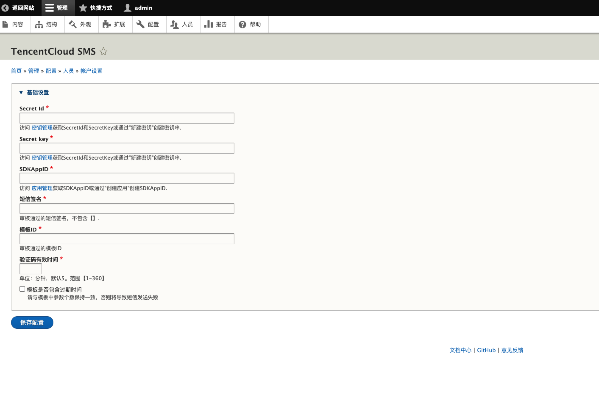
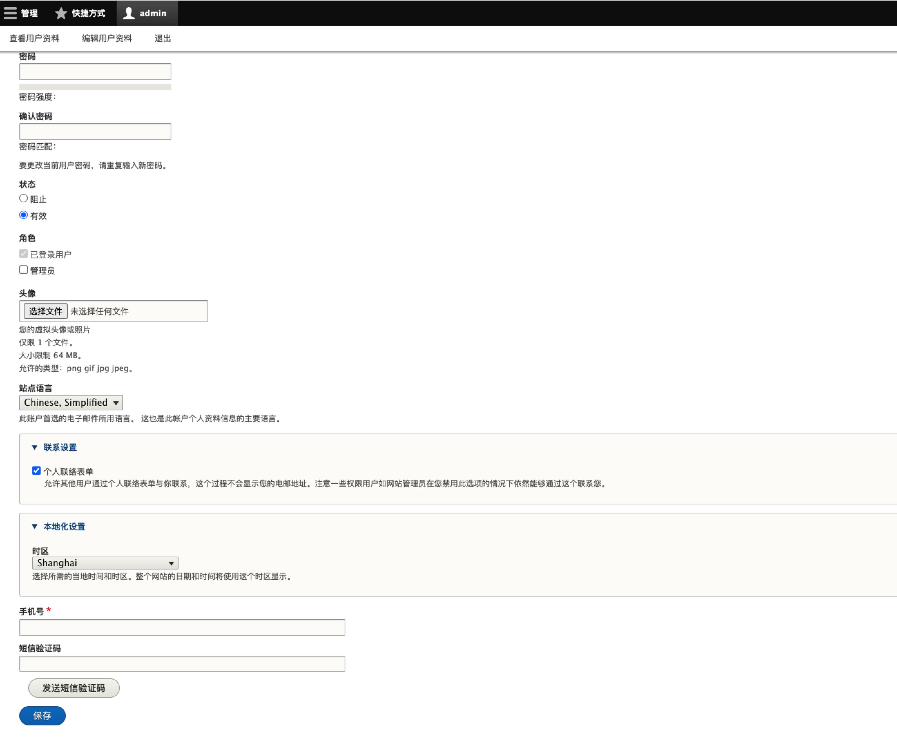
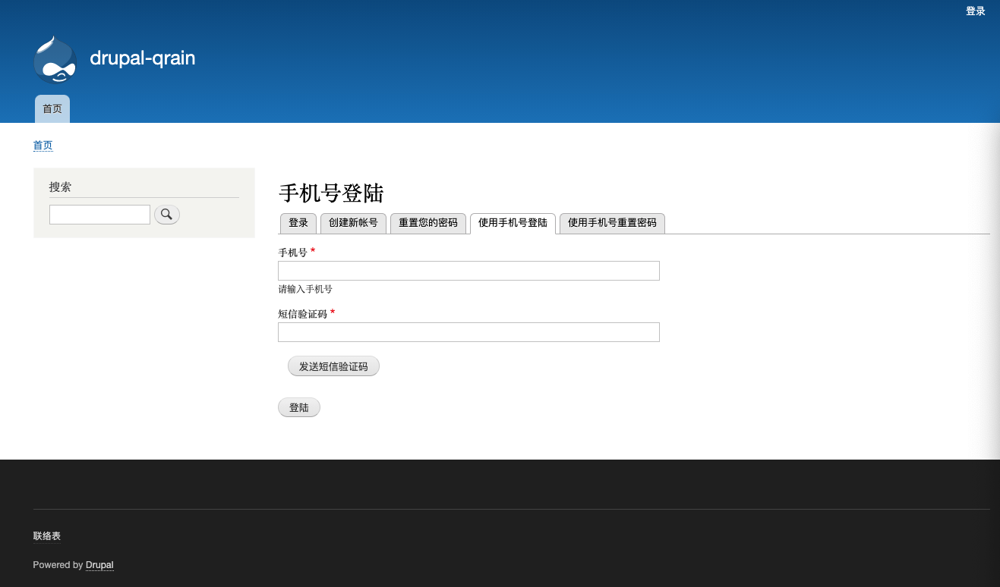
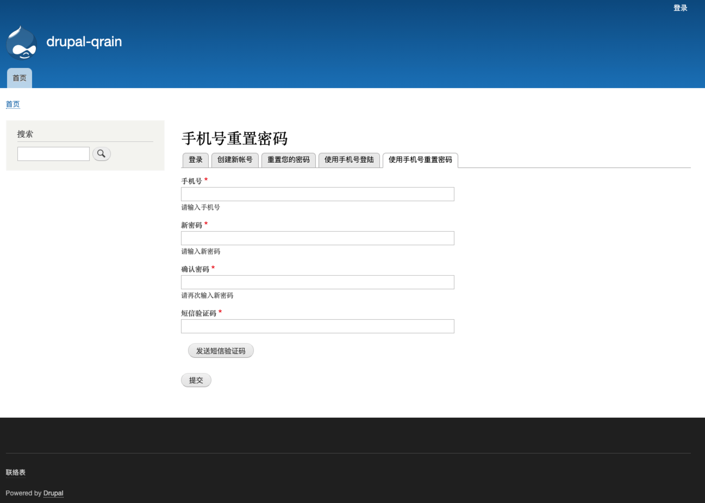

# 腾讯云短信插件

## 0.版本依赖

- 依赖 PHP 5.5+ 环境

- GuzzleHttp 6.3.0+ (如果有其它插件引用了 GuzzleHttp 库并低于 6.3.0 版本会引起插件冲突)

## 1.插件介绍
> tencentcloud_sms插件是一款腾讯云研发的，提供给Drupla站长使用的官方插件。使支持手机号登录,通过手机号+短信验证码找回密码等功能

| 标题       | 内容                                                         |
| ---------- | ------------------------------------------------------------ |
| 中文名称    | 腾讯云短信（SMS）插件                                         |
| 英文名称    | tencentcloud_sms                                       |
| 最新版本    | v1.0.0 (2020.09.30)                                           |
| 适用平台    | [Drupal9.0.7](https://www.drupal.org/) |
| 适用产品    | [腾讯云短信（SMS）](https://cloud.tencent.com/product/sms)      |
| GitHub项目 | [tencentcloud-drupla-plugin-sms](https://github.com/Tencent-Cloud-Plugins/tencentcloud-drupal-plugin-sms) |
| 主创团队    | 腾讯云中小企业产品中心（SMB Product Center of Tencent Cloud）             |

## 2.功能特性

- 支持在个人资料页绑定手机号
- 通过手机号/短信验证码登陆站点。
- 支持通过短信验证码重置用户密码。

## 3.安装指引

### 3.1.部署方式一：通过GitHub部署安装

> 1. git clone https://github.com/Tencent-Cloud-Plugins/tencentcloud-drupal-plugin-sms.git
> 2. 复制tencentcloud_sms 文件夹 到Drupal安装路径/modules/文件夹里面
> 3. 在网站后台"扩展"中安装腾讯云短信验证码插件

## 4.使用指引

### 4.1.界面功能介绍

> 后台配置页面。配置介绍请参考下方的[名词解释](#_4-2-名词解释)

> 个人设置页新增绑定手机号输入框

> 选择使用手机号的登录页面

> 选择使用手机号找回密码的操作框输入

### 4.2.名词解释
- **自定义密钥：** 插件提供统一密钥管理，既可在多个腾讯云插件之间共享SecretId和SecretKey，也可为插件配置单独定义的腾讯云密钥。
- **Secret ID：** 在[腾讯云API密钥管理](https://console.cloud.tencent.com/cam/capi)上申请的标识身份的 SecretId。
- **Secret Key：** 在[腾讯云API密钥管理](https://console.cloud.tencent.com/cam/capi)上申请的与SecretId对应的SecretKey。
- **SDKAppID：** 在[腾讯云短信应用管理](https://console.cloud.tencent.com/smsv2/app-manage)上创建到应用ID。
- **短信签名：** 在[腾讯云短信签名管理](https://console.cloud.tencent.com/smsv2/csms-sign)审核通过的短信签名，不包含【】。
- **模板ID：** 在[腾讯云短信正文模板管理](https://console.cloud.tencent.com/smsv2/csms-template)审核通过的模板ID。

## 5.FAQ

> 暂无

## 6.GitHub版本迭代记录

### 6.1 tencentcloud-drupal-plugin-sms v1.0.0
- 支持在个人资料页绑定手机号
- 通过手机号/短信验证码登陆站点。
- 支持通过短信验证码重置用户密码。

---

本项目由腾讯云中小企业产品中心建设和维护，了解与该插件使用相关的更多信息，请访问[春雨文档中心](https://openapp.qq.com/docs/Chevereto/cos.html) 

请通过[咨询建议](https://da.do/y0rp) 向我们提交宝贵意见。
